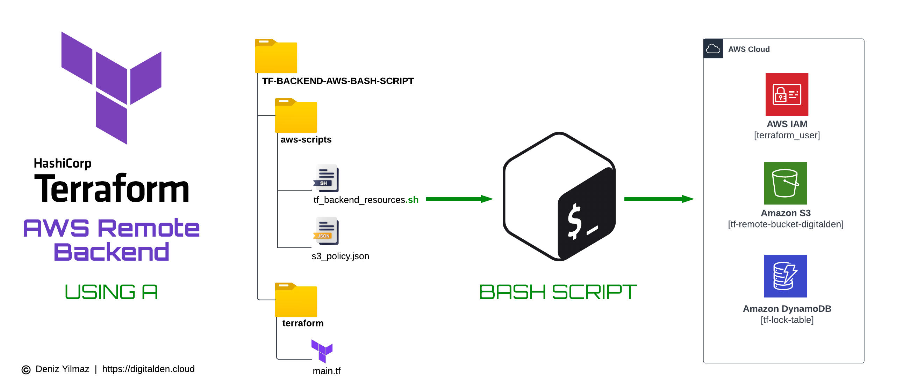

<h1 align="center">Setting Up Terraform Remote Backend With AWS Using A Bash Script</h1>

    Solving the Terraform State Backend Chicken and Egg Problem with a Bash Script

## Project Date
- 5 October 2023

## Tech Stack
- Terraform
- Bash
- AWS Identity Access Management (IAM)
- Amazon S3
- Amazon DynamoDB

## More Info
🔗 [Video Demo ](https://youtu.be/-qTvkOolvQc)
🔗 [Blog ](https://aws.plainenglish.io/setting-up-terraform-remote-backend-with-aws-using-a-bash-script-6549d8e62a6)

## Overivew
Welcome to the GitHub repository that hosts the scripts used to configure a Terraform backend using S3 and DynamoDB.

The Terraform "chicken-and-egg problem" on AWS is the challenge of deciding whether to create AWS resources first or configure Terraform's state storage. You need both, but defining one depends on the other, creating a circular dilemma. Strategies like using a Bash script can help break this loop and manage Terraform state effectively.

Here's a explanation of how this solution works:

1. **Terraform Configuration**: In your Terraform configuration file (main.tf), you define AWS backend resources like the S3 bucket for Terraform state and the DynamoDB table for locking.

2. **Bash Script**: A Bash script is used to create these AWS backend resources. It contains AWS CLI commands to create IAM user, S3 bucket, DynamoDB table, and configure bucket policies.

3. **Execution Order**: The Bash script runs before configuring Terraform's backend in main.tf, ensuring AWS backend resources exist before Terraform needs them.

4. **Resource Creation**: The Bash script creates IAM user, S3 bucket, DynamoDB table based on your Terraform configuration, applying necessary policies.

5. **Terraform State File**: After resources are created, Terraform initializes its backend configuration, setting up S3 and DynamoDB as the state store. Terraform generates and stores its state file in the configured S3 bucket.

This sequence ensures that Terraform backend resources are created independently before Terraform uses them. It aligns Terraform's configuration with AWS resources, ensuring effective state management and consistency.